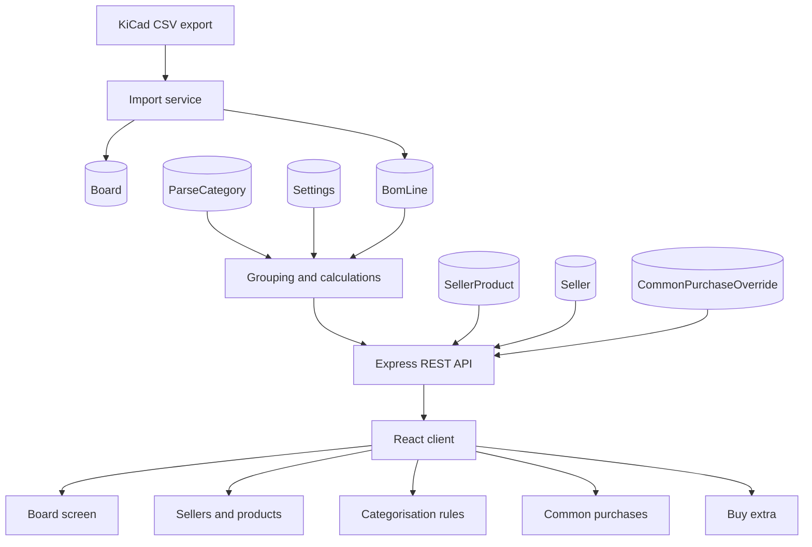
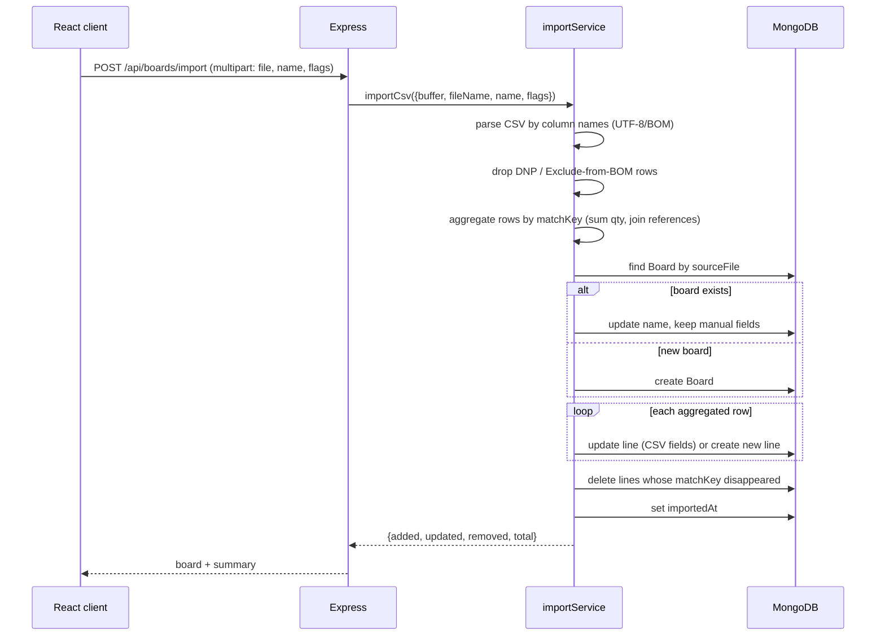

# Architecture

## Components

| Layer | Location | Responsibility |
|-------|----------|----------------|
| Shared domain | [`src/shared/`](../src/shared) | Value parsing, categorisation, sorting. No dependencies, no I/O — imported by the server and the tests. |
| API | [`src/server/`](../src/server) | Express routes, Mongoose models, services (import, grouping, common purchases). |
| Client | [`src/client/`](../src/client) | React (Vite) UI, MUI components, thin `fetch` API layer. |
| Tests | [`tests/`](../tests) | Node `node:test` suites: shared unit tests and API integration tests. |

The shared module is deliberately pure so the exact same code drives the server
and is verified by the unit tests.

## High-level data flow

## Import / re-import

Key points:

- Matching is by `matchKey` (normalised nominal + normalised footprint), so
  `4K7` and `4.7K` with the same footprint are the same row.
- Hand-filled `productId`, `common`, `packsOverride` and `shippingCost` are
  never touched by a re-import.
- Rows absent from the new file are deleted.

## Grouping and calculated columns

On every board / common-purchases request the API:

1. Loads the current `ParseCategory` documents (ascending `order`) and
   `Settings`.
2. For each stored line, resolves `{category, subcategory, sort}` via
   [`resolveCategory()`](../src/shared/categories.js): a rule may constrain
   Reference, Value and/or Footprint (`prefix` / `regex` / `contains`), combined
   with AND; matching ignores case unless the rule sets `caseSensitive`.
3. Groups rows into blocks: categories in configured order, then subcategories
   (declared order, then the "no subcategory" block), then sorted rows.
4. Computes the purchase columns (server-side, never stored):

   | Field | Formula |
   |-------|---------|
   | `totalQty` | `qty × board.count` (boards) / `Σ qty × board.count` (common) |
   | `packs` | `packsOverride ?? (product ? ceil(totalQty / product.packQty) : null)` |
   | `shippingCost` | `shippingOverride ?? product.shippingCost` |
   | `cost` | `packs != null && product ? packs × product.packPrice + (shippingCost || 0) : null` |

   The product also yields the seller: a row stores only `productId`, and the
   shop name/link is resolved through the product.

5. Sums the "Итого" totals over the visible rows; rows with `common: true` are
   excluded from a board's "Итого" (they are counted on the common sheet).

Category and subcategory are recalculated on the fly so that editing a rule in
the UI is reflected on every board immediately, without a data migration.

## Common purchases

"Common purchases" is virtual: it aggregates every `BomLine` with
`common: true` from all boards (including "Докупить") by `matchKey`,
multiplying each contribution by its board's `count`. Only the manual
product/packages/shipping overrides are stored, in `CommonPurchaseOverride`, keyed by
`matchKey`, so they survive re-imports and changes in the set of contributing
boards. Two presentation modes are supported: `merged` (one "нужно всего"
row) and `by_board` (an extra column per contributing board).

## Startup

[`src/server/index.js`](../src/server/index.js) connects to MongoDB, ensures
the `Settings` singleton, seeds the default categories when the collection is
empty, and creates the "Докупить" service board. If MongoDB is unreachable the
process prints a friendly message and exits non-zero instead of crashing with a
stack trace.

## UI composition

The board purchase table is a single component,
[`PurchaseBoardView`](../src/client/components/PurchaseBoardView.jsx), used both
by the board screen (opened from "Платы") and by the "Закупки" tab. The tab adds
a board selector in its header (the service "Докупить" board has its own tab and
is not listed there). Both read the same endpoint, `GET /api/boards/:id/lines`,
so behaviour and calculations never diverge.

### Persisted UI state

The screens remember "what the user was working with" (selected board, page,
filters, seller per board, mode) in a per-user `UiState` document served by
`/api/ui-state`. The client loads it once
([`UiStateContext`](../src/client/UiStateContext.jsx)), reads a slice through
[`useUiState`](../src/client/hooks/useUiState.js) and writes changes back with a
debounce; the server deep-merges a patch section by section, so parallel tabs
editing different screens do not overwrite each other. In the purchase tables the
URL stays the source of truth for the current view and the stored state is
restored only when the page is opened without parameters (e.g. by clicking the
tab). The document is keyed by a user id — an implicit default until
authentication exists, at which point it becomes per-account.

## Atomicity

Several operations touch more than one document:

| Operation | Documents written |
|-----------|-------------------|
| Import / re-import | `Board` + create/update/delete of its `BomLine`s |
| Delete a board | `Board` + `BomLine.deleteMany` |
| Delete a seller | `Seller` + its `SellerProduct`s + clearing `productId` in lines/overrides |
| Bulk line update | `BomLine.updateMany` over the grouped lines |

None of them runs inside a session/transaction. On a standalone `mongod`
transactions are unavailable, so the services are written to be **idempotent
where possible** (re-import converges on the next run, deletion can be retried)
and the failure mode is a partially applied change rather than data corruption.
To make these operations atomic, run MongoDB as a replica set and pass a session
to `updateMany` / `deleteMany` / `create`.

The purchase calculations themselves are pure functions in
[`src/shared/purchase.js`](../src/shared/purchase.js), so the board, "Все" and
common-purchases views share a single implementation and cannot drift apart.
