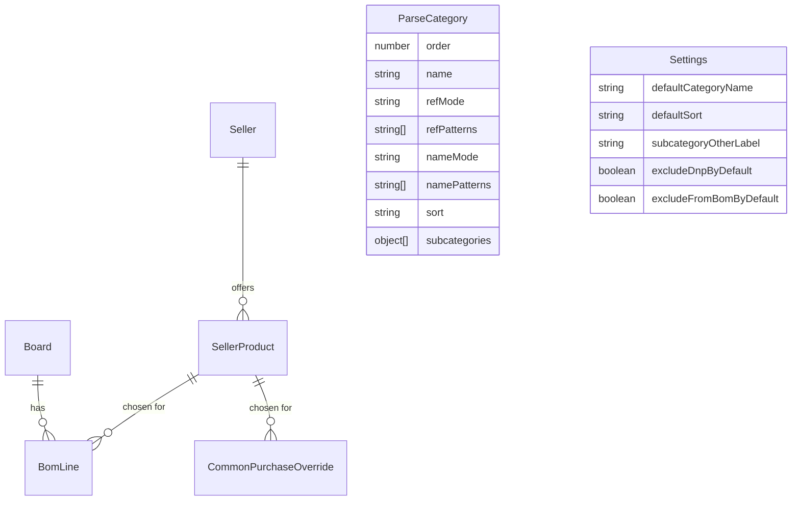

# Data model

Mongoose schemas live in [`src/server/models/`](../src/server/models).



A **seller** is a shop, a **product** (offer) belongs to exactly one shop and
carries the commercial data (packaging, price, delivery). Rows and common
overrides point at a **product**, never at a shop; the shop is derived through
the product.

## `Board`

| Field | Type | Notes |
|-------|------|-------|
| `name` | String | Human-readable, editable |
| `sourceFile` | String | **Unique (sparse)**. Re-import key; a renamed file needs an explicit `targetBoardId`; omitted for the "Докупить" board |
| `count` | Number | Boards in the product; multiplies "Итого" (`min 1`) |
| `isService` | Boolean | True only for the single "Докупить" board |
| `enabled` | Boolean | "Включено" — the board takes part in the app (selectors, common) |
| `inCommon` | Boolean | "В общих закупках" — its `Общие` rows feed the common sheet |
| `importedAt` | Date | Last import time |

### Re-import guard

Re-import is keyed by `sourceFile`. A renamed export (a new board revision)
would otherwise create a second board while the old one keeps feeding the common
purchases, so the client sends the explicit `targetBoardId` of the board to
update. When the uploaded file name differs from that board's `sourceFile`, the
server answers `409` with `details.code = "SOURCE_FILE_MISMATCH"` until the
request also carries `renameSourceFile`; on success `sourceFile` is overwritten
with the new name. An incoming name that already belongs to another board is
rejected with `details.code = "SOURCE_FILE_TAKEN"`.

## `BomLine`

| Field | Type | Notes |
|-------|------|-------|
| `boardId` | ObjectId → `Board` | Indexed |
| `reference` | String | As in the CSV (`C2,C3`) |
| `qty` | Number | |
| `value` | String | As in the CSV (or the reference when empty) |
| `footprint` | String | Normalised (trimmed, `", "` separators) |
| `matchKey` | String | See below; compound unique index `{boardId, matchKey}` |
| `raw` | Mixed | Remaining CSV columns verbatim |
| `productId` | ObjectId → `SellerProduct` \| null | Hand-filled, survives re-import |
| `common` | Boolean | Hand-filled, survives re-import |
| `notPurchased` | Boolean | "Не закупается": left out of the totals and hidden by default, survives re-import |
| `packsOverride` | Number \| null | Hand-entered package count (`null` = auto) |
| `shippingCost` | Number \| null | Hand-entered delivery for this row (`null` = the product's default) |
| `description` | String | Hand-filled note per position, survives re-import |
| `manual` | Boolean | True for rows added by hand on "Докупить" |

### `matchKey`

`matchKey = buildNominalToken(parseValue(value)) + "\u0001" + normalizeMatchText(footprint)`.

- Parsed nominals are normalised to `unit|magnitude|suffix`, so `4K7` and
  `4.7K` produce the same key and `2.2 uF` differs from `2.2 uF 25V`.
- Unparsed values (part numbers) keep their spelling.
- It is **independent of the category**, so editing categorisation rules never
  invalidates stored hand-filled values.

## `Seller`

| Field | Type | Notes |
|-------|------|-------|
| `name` | String | **Unique**, required |
| `url` | String | Page of the shop; may be empty |
| `description` | String | Free text |

Deleting a seller cascades to its products and clears the `productId`
references in `BomLine` and `CommonPurchaseOverride`.

## `SellerProduct`

| Field | Type | Notes |
|-------|------|-------|
| `sellerId` | ObjectId → `Seller` | Required, indexed |
| `name` | String | Required; indexed together with `sellerId` (not unique) |
| `url` | String | Link to the concrete offer; may be empty |
| `packQty` | Number | Units per package, `min 1` |
| `packPrice` | Number | Price of one package, `min 0` |
| `shippingCost` | Number | Delivery of this offer, `min 0`; used when the row has none |
| `category` | String | Informational (categorisation hint) |
| `footprint` | String | Informational mask (`Capacitor_SMD:C_0402_*`) |
| `description` | String | Free text |

Deleting a product clears the `productId` references in `BomLine` and
`CommonPurchaseOverride`; the rows themselves survive.

## `ParseCategory`

| Field | Type | Notes |
|-------|------|-------|
| `order` | Number | Ascending; the first match wins |
| `name` | String | Required |
| `refMode` | `prefix` \| `regex` | Default `prefix` |
| `refPatterns` | [String] | Prefix letters or regexes |
| `nameMode` | `prefix` \| `regex` | Default `prefix` |
| `namePatterns` | [String] | Value prefixes or regexes |
| `footprintMode` | `prefix` \| `regex` \| `contains` | Default `prefix` |
| `footprintPatterns` | [String] | Footprint prefixes / substrings / regexes |
| `caseSensitive` | Boolean | Applies to all three comparisons (default `false`) |
| `sort` | `value_desc` \| `value_asc` \| `name` \| null | Falls back to `Settings.defaultSort` |
| `subcategories` | [{name, footprintContains}] | Checked in array order |

At least one of `refPatterns` / `namePatterns` / `footprintPatterns` is required.
When more than one of the three is set, the row must satisfy **all** of them
(AND). In `regex` mode every pattern must compile; validation runs on save and
returns a readable message naming the offending pattern.

## `Settings` (singleton)

| Field | Default |
|-------|---------|
| `defaultCategoryName` | `Прочее` |
| `defaultSort` | `name` |
| `pageWidth` | `normal` (1536) / `wide` (1920) / `full` (100%) |
| `subcategoryOtherLabel` | `(без подкатегории)` |
| `excludeDnpByDefault` | `true` |
| `excludeFromBomByDefault` | `true` |

## `CommonPurchaseOverride`

| Field | Type | Notes |
|-------|------|-------|
| `matchKey` | String | **Unique**; not tied to a board |
| `productId` | ObjectId → `SellerProduct` \| null | |
| `packsOverride` | Number \| null | Hand-entered package count (`null` = auto) |
| `shippingCost` | Number \| null | Hand-entered delivery (`null` = the product's default) |
| `notPurchased` | Boolean | "Не закупается": left out of the aggregate totals |

## Calculated columns

The server sends the numbers ready-made (no formulas on the client):

```
totalQty   = qty × board.count                 (или сумма по платам для «Общих»)
packs      = packsOverride ?? ceil(purchaseQty / product.packQty)
shipping   = line/override shippingCost ?? product.shippingCost
cost       = packs × product.packPrice + (shipping || 0)     (null без товара)
```

Rows with `common` are excluded from the board "Итого" — they are bought on the
"Общие закупки" sheet.

Rows with `notPurchased` ("Не закупается") are left out of the totals everywhere
— the board, the "Все" tab and the common sheet. The purchase tables narrow the
rows with the `rowMode` combobox: `all` (default) shows every row, `notPurchased`
keeps only the flagged ones, `unfilled` keeps the rows that are neither "Не
закупается" nor "Общие" and have no seller (no product chosen), and `common` (the
board table only) keeps only the "Общие" rows. On the board a line marked "Общие"
takes the flag from its `CommonPurchaseOverride` (read-only there); on the "Все"
tab the flag applies to every line behind the row.

## Migration from the previous model

`npm run migrate` (also executed at startup, idempotent) applies
[`src/server/services/migrationService.js`](../src/server/services/migrationService.js):

1. every `Seller` gets one `SellerProduct` named like the shop, inheriting
   `packQty`, `packPrice`, `shippingCost`, `category`, `description`,
   `footprint`;
2. `BomLine.sellerId` and `CommonPurchaseOverride.sellerId` become `productId`;
3. the legacy fields are `$unset` on the seller, so the shop documents keep
   only `name`, `url` and `description`.

A second run changes nothing. If an earlier run already created the products,
the delivery cost is backfilled into them before the seller field is dropped;
a product that already has its own cost keeps it. The delivery field is only
removed from the seller once the value really lives on the product, so no cost
can be lost.
