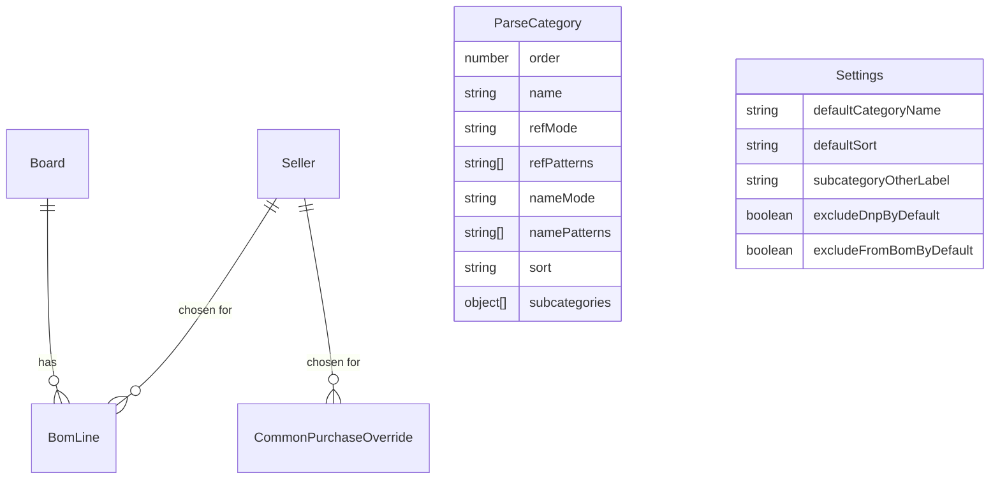

# Data model

Mongoose schemas live in [`src/server/models/`](../src/server/models).

## `Board`

| Field | Type | Notes |
|-------|------|-------|
| `name` | String | Human-readable, editable |
| `sourceFile` | String | **Unique (sparse)**. Re-import key; omitted for the "Докупить" board |
| `count` | Number | Boards in the product; multiplies "Итого" (`min 1`) |
| `isService` | Boolean | True only for the single "Докупить" board |
| `importedAt` | Date | Last import time |

## `BomLine`

| Field | Type | Notes |
|-------|------|-------|
| `boardId` | ObjectId → `Board` | Indexed |
| `reference` | String | As in the CSV (`C2,C3`) |
| `qty` | Number | |
| `value` | String | As in the CSV (or the reference when empty) |
| `footprint` | String | Normalised (trimmed, `", "` separators) |
| `matchKey` | String | See below; compound unique index `{boardId, matchKey}` |
| `raw` | Mixed | Remaining CSV columns verbatim |
| `sellerId` | ObjectId → `Seller` \| null | Hand-filled, survives re-import |
| `common` | Boolean | Hand-filled, survives re-import |
| `shippingCost` | Number \| null | Hand-filled, not tied to the seller |
| `description` | String | Hand-filled note per position, survives re-import |
| `manual` | Boolean | True for rows added by hand on "Докупить" |

### `matchKey`

`matchKey = buildNominalToken(parseValue(value)) + "\u0001" + normalizeMatchText(footprint)`.

- Parsed nominals are normalised to `unit|magnitude|suffix`, so `4K7` and
  `4.7K` produce the same key and `2.2 uF` differs from `2.2 uF 25V`.
- Unparsed values (part numbers) keep their spelling.
- It is **independent of the category**, so editing categorisation rules never
  invalidates stored hand-filled values.

## `Seller`

| Field | Type | Notes |
|-------|------|-------|
| `name` | String | **Unique**, required |
| `category` | String | Informational |
| `footprint` | String | Informational mask (`Capacitor_SMD:C_0402_*`) |
| `url` | String | |
| `packQty` | Number | `min 1` |
| `packPrice` | Number | `min 0` |
| `shippingCost` | Number | Reference only; not used in row cost |
| `description` | String | |

Deleting a seller clears the references in `BomLine` and
`CommonPurchaseOverride`.

## `ParseCategory`

| Field | Type | Notes |
|-------|------|-------|
| `order` | Number | Ascending; the first match wins |
| `name` | String | Required |
| `refMode` | `prefix` \| `regex` | Default `prefix` |
| `refPatterns` | [String] | Prefix letters or regexes |
| `nameMode` | `prefix` \| `regex` | Default `prefix` |
| `namePatterns` | [String] | Value prefixes or regexes |
| `footprintMode` | `prefix` \| `regex` \| `contains` | Default `prefix` |
| `footprintPatterns` | [String] | Footprint prefixes / substrings / regexes |
| `caseSensitive` | Boolean | Applies to all three comparisons (default `false`) |
| `sort` | `value_desc` \| `value_asc` \| `name` \| null | Falls back to `Settings.defaultSort` |
| `subcategories` | [{name, footprintContains}] | Checked in array order |

At least one of `refPatterns` / `namePatterns` / `footprintPatterns` is required.
When more than one of the three is set, the row must satisfy **all** of them
(AND). In `regex` mode every pattern must compile; validation runs on save and
returns a readable message naming the offending pattern.

## `Settings` (singleton)

| Field | Default |
|-------|---------|
| `defaultCategoryName` | `Прочее` |
| `defaultSort` | `name` |
| `subcategoryOtherLabel` | `(без подкатегории)` |
| `excludeDnpByDefault` | `true` |
| `excludeFromBomByDefault` | `true` |

## `CommonPurchaseOverride`

| Field | Type | Notes |
|-------|------|-------|
| `matchKey` | String | **Unique**; not tied to a board |
| `sellerId` | ObjectId → `Seller` \| null | |
| `shippingCost` | Number \| null | |
