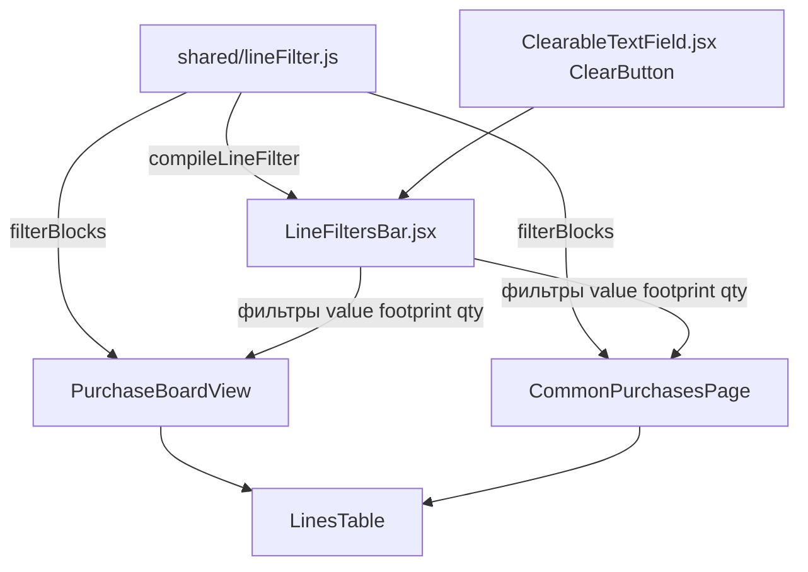

# План: фильтры в таблицах закупок

## Цель

Над таблицами закупок добавить панель фильтров, применяемых к **строкам** (а не
только к списку товаров, как существующий фильтр «Продавец»):

- **Наименование (`value`)** — текст: подстрока или regex, опциональный учёт
  регистра; выпадашка со значениями из текущей платы/закупки; крестик очистки.
- **Корпус/Footprint** — то же самое.
- **Количество** — по колонке **«Итого»** (`row.totalQty`, в «Общих закупках» —
  «Нужно всего»): операторы **больше / меньше / строго равно** + число; крестик.

Экраны: «Закупки» (одна плата) — [`PurchaseBoardView`](src/client/components/PurchaseBoardView.jsx:40)
и «Общие закупки» — [`CommonPurchasesPage`](src/client/pages/CommonPurchasesPage.jsx:31).

## Модель фильтрации (принятые решения)

- Все условия объединяются по **AND**; пустое поле = условие не активно.
- `value` и `footprint`: по умолчанию — подстрока без учёта регистра; чекбокс
  **регекс** включает регулярное выражение; чекбокс **учёт регистра** отключает
  регистронезависимость (флаг `i`).
- Количество сравнивается с `totalQty` (целое). Пустое число или
  невыбранный оператор = условие не активно.
- Скрываются заголовки категорий/подкатегорий, под которыми не осталось ни
  одной подходящей строки.
- **Итого**/**Доставка** продолжают считаться по полному списку (фильтр влияет
  только на видимые строки). Существующий фильтр «Продавец» сохраняется и
  продолжает сужать список товаров в колонке «Товар».
- Состояние фильтров — локальное, сбрасывается при смене платы/режима;
  в URL не сохраняется.

## Архитектура

Ключевые идеи:

1. Чистая логика фильтрации строк и блоков — в общем модуле
   [`src/shared/lineFilter.js`](src/shared/lineFilter.js) (рядом с
   [`textFilter.js`](src/shared/textFilter.js:1)), чтобы её можно было
   покрыть unit-тестами без рендера React.
2. Переиспользуемая панель [`LineFiltersBar`](src/client/components/LineFiltersBar.jsx)
   с `Autocomplete freeSolo` (выпадашка + свободный ввод) и `ClearButton`
   (по образцу [`ProductCell`](src/client/components/LinesTable.jsx:255)).
3. [`filterBlocks()`](src/shared/lineFilter.js) принимает те же `blocks`, что и
   [`LinesTable`](src/client/components/LinesTable.jsx:98), и возвращает
   отфильтрованный список с сохранением заголовков.

## Файлы

- Новый: `src/shared/lineFilter.js` — `compileLineFilter()`, `filterBlocks()`,
  вспомогательная нормализация.
- Правка: `src/shared/index.js` — реэкспорт новых функций.
- Новый: `src/client/components/LineFiltersBar.jsx` — UI панели фильтров.
- Правка: `src/client/components/PurchaseBoardView.jsx` — состояние фильтров,
  опции из строк платы, `visibleBlocks`, вёрстка панели, сброс по `board.id`.
- Правка: `src/client/pages/CommonPurchasesPage.jsx` — то же для «Общих закупок».
- Новый: `tests/shared/lineFilter.test.js` — тесты чистой логики.

Строки для построения списков опций берутся из переданных `blocks` (только
`kind === 'line'`); поля `value`, `footprint`, `totalQty` уже есть в
сериализованных строках — см. [`serializeBlocks()`](src/server/services/grouping.js:109).

## Шаги

1. Создать [`src/shared/lineFilter.js`](src/shared/lineFilter.js):
   - `compileTextMatch(pattern, { regex, caseSensitive })` → `{ active, error, match(text) }`
     (regex → `new RegExp(pattern, flags)`, иначе подстрока; флаг `i`, если не
     задан учёт регистра);
   - `compileLineFilter({ value, valueRegex, valueCaseSensitive, footprint,
     footprintRegex, footprintCaseSensitive, qtyOp, qty })` →
     `{ active, errors: { value, footprint }, match(row) }`, где `qtyOp` —
     `'gt' | 'lt' | 'eq'`;
   - `filterBlocks(blocks, match)` — оставляет подходящие `line`-блоки и
     заголовки `category`/`subcategory` только при наличии совпадений ниже,
     сохраняя порядок.
2. Реэкспортировать новые функции из [`src/shared/index.js`](src/shared/index.js:24).
3. Написать [`tests/shared/lineFilter.test.js`](tests/shared/lineFilter.test.js):
   подстрока/регистр, regex (валидный и некорректный), операторы количества,
   отбрасывание пустых заголовков, комбинирование условий.
4. Создать [`src/client/components/LineFiltersBar.jsx`](src/client/components/LineFiltersBar.jsx):
   - пропсы `rows`, `filters`, `onChange`;
   - `value` и `footprint`: `Autocomplete freeSolo` с опциями (уникальные
     непустые значения), `ClearButton` в `renderInput`, чекбоксы «регекс» и
     «учёт регистра», подсветка ошибки regex;
   - количество: `TextField select` (оператор больше/меньше/равно) + числовое
     поле с `ClearableTextField`/`ClearButton`;
   - адаптивная вёрстка в один `Stack` с переносом.
5. Интегрировать в [`PurchaseBoardView.jsx`](src/client/components/PurchaseBoardView.jsx:40):
   - состояние фильтров, сброс при смене `board.id`;
   - `rows` = строки из `blocks`; `filter = useMemo(compileLineFilter)`;
   - `visibleBlocks = useMemo(filterBlocks(blocks, filter.match))`;
   - передать `visibleBlocks` в [`LinesTable`](src/client/components/LinesTable.jsx:98),
     а в `resetKey` — подпись фильтров, чтобы сбрасывать пагинацию;
   - разместить панель над таблицей, рядом с селектом «Продавец (фильтр)».
6. Сделать то же в [`CommonPurchasesPage.jsx`](src/client/pages/CommonPurchasesPage.jsx:31)
   (количество — по `totalQty`, «Нужно всего»), с учётом режимов
   `merged`/`by_board`.
7. Проверки:
   - `npm test` — новые unit-тесты и отсутствие регрессий;
   - `npm run build` — сборка Vite без ошибок;
   - `npm run dev` — вручную: фильтры сужают строки, чекбоксы регекс/регистр
     работают, крестики очищают поля, заголовки пустых категорий исчезают,
     итоги не меняются, смена платы/режима сбрасывает фильтры.

## Границы

- Только клиент и общий модуль; серверное API и модели не меняются.
- Новых npm-зависимостей нет (используются MUI и существующий `ClearButton`).
- Вкладка «Докупить» ([`ManualPage`](src/client/pages/ManualPage.jsx)) в этот
  объём не входит — при необходимости добавим тем же компонентом отдельно.
